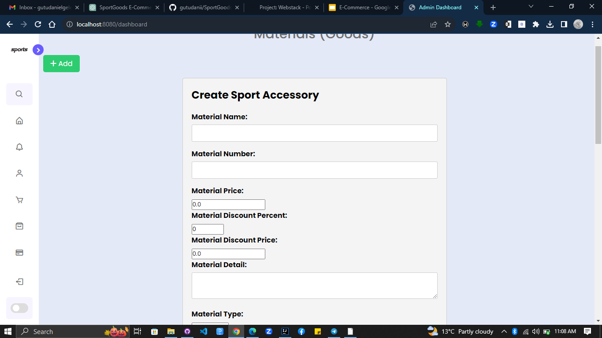

# SportGoods E-Commerce Website

Welcome to the SportGoods E-Commerce Website repository! This project is an online platform designed to make buying and selling sports equipment a breeze. Whether you're an athlete, sports enthusiast, or simply looking for high-quality sports gear, SportGoods has got you covered.

### Image

##Image 

##Image

##Image

##Image

##Image

##Image

## Table of Contents

- [Introduction](#introduction)
- [Project Overview](#project-overview)
- [Core Features](#core-features)
- [Technology Stack](#technology-stack)
- [Agile Method](#agile-method)
- [Project Planning](#project-planning)
- [Backend Development](#backend-development)
- [Frontend Development](#frontend-development)
- [Admin Dashboard](#admin-dashboard)
- [Advanced Features](#advanced-features)
- [Testing and Deployment](#testing-and-deployment)
- [Contact Information](#contact-information)
- [Getting Started](#getting-started)
- [Contributing](#contributing)
- [License](#license)

## Introduction

Hello, everyone! I am Gutu Daniel, and I'm thrilled to present my project: a sport goods e-commerce website. I'm passionate about sports and wanted to create a platform that allows enthusiasts to buy and sell sports equipment easily.

## Project Overview

The main goal of my e-commerce website is to provide a user-friendly platform for customers to explore and purchase sports goods. Whether you need balls, sport pants, or any other sports equipment, SportGoods has you covered.

## Core Features

Let me walk you through the core features of my e-commerce website:

- **Product Listing:** Displaying a wide range of sports goods, including balls, sport pants, and more.
- **Product Details Page:** Providing detailed information about each product.
- **Shopping Cart:** Allowing users to add, remove, and update items for purchase.
- **Checkout:** Providing a seamless and secure checkout process.
- **User Registration/Login:** Allowing users to create accounts and log in to track orders and preferences.
- **Payment Methods:** Supporting Telebirr and PayPal for secure payment processing.
- **Secured with Spring Security:** Ensuring the safety of user data and transactions.

## Technology Stack

To bring this project to life, I'm utilizing the following technologies:

- **Frontend:** Thymeleaf for dynamic and responsive web pages.
- **Backend:** Spring Boot and Java for building a robust and scalable server.
- **Database:** MySQL to store product information, user accounts, and orders.

## Agile Method

I have chosen the Agile methodology for my development process. Agile allows me to adapt to changes, collaborate efficiently, and deliver incremental updates.

## Project Planning

I started the project by carefully gathering requirements and planning the overall structure. Creating wireframes helped me visualize the layout and user experience.

## Backend Development

On the backend, I have set up my Spring Boot application to handle API endpoints and business logic. The integration with MySQL enables smooth data management.

## Frontend Development

Thymeleaf has been my choice for the frontend, ensuring a dynamic and interactive user interface. I've developed pages for product listing, details, shopping cart, checkout, and user registration/login.

## Admin Dashboard

As an admin, I've also developed a feature-rich dashboard for controlling various aspects of the website, including adding new products, managing user accounts, and more. Here's a sneak peek:

## Advanced Features

In addition to the core features, I'm working on implementing some advanced functionalities:

- **Search Functionality:** So users can easily find specific sports goods.
- **User Profiles:** Allowing users to manage their information and view order history.

## Testing and Deployment

Testing is crucial to ensure the website's functionality and security. I'll deploy the website on a reliable web server or cloud platform for accessibility.

## Contact Information

You can reach me at:

- **Email:** gutudanielgeleta@gmail.com

Feel free to contact me for any inquiries or collaborations.

## Getting Started

To get started with the SportGoods E-Commerce Website project, follow these steps:

1. Clone this repository to your local machine.
2. Set up the required configurations in `application.properties`.
3. Build and run the Spring Boot application.
4. Access the website in your web browser.

## Contributing

We welcome contributions to make SportGoods even better! Please fork the repository and create pull requests for any enhancements or bug fixes.

## License

This project is licensed under the [MIT License](LICENSE.md).

Thank you for your interest in SportGoods! We look forward to your feedback and support. Happy shopping! 🏀🏋️‍♂️🚴‍♀️
